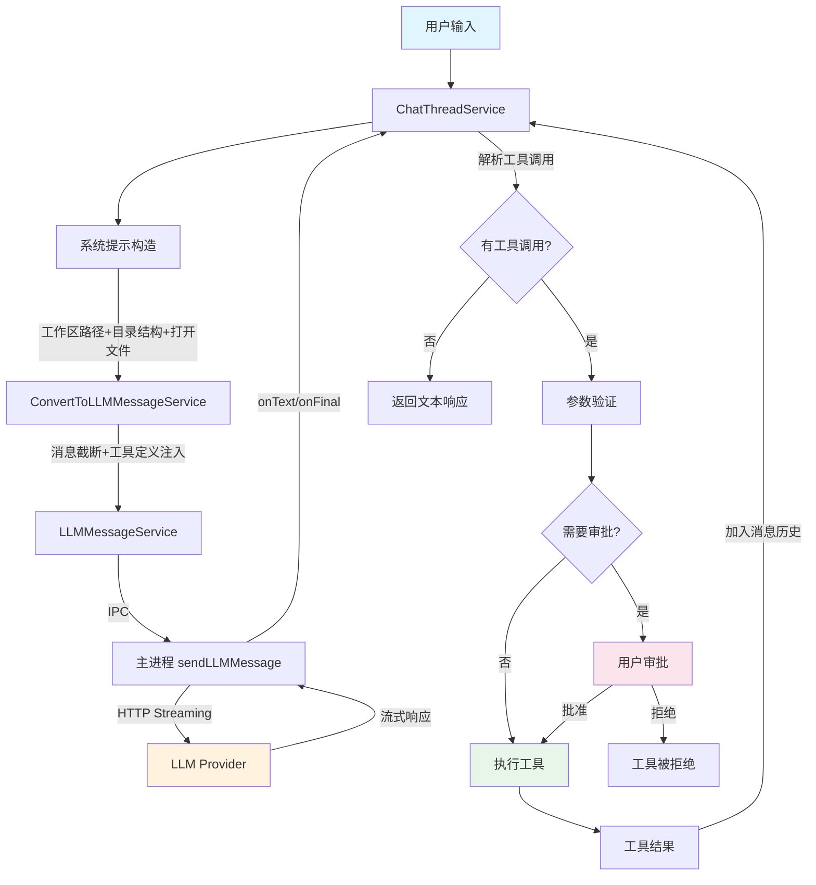

# Void 编辑器编程工作流全面分析

> 分析日期：2025-07
> 目标：梳理 Void 当前编程业务流程、对比主流方案、识别缺失项、提出预期方案与差距分析

---

## 一、Void 当前编程业务流程

### 1.1 整体架构概览

Void 编辑器的编程工作流围绕以下核心服务构建：

| 服务 | 文件位置 | 核心职责 |
|------|----------|----------|
| `ToolsService` | `browser/toolsService.ts` | 内置工具参数验证与调用执行（含 batch_edit）|
| `ChatThreadService` | `browser/chatThreadService.ts` | 聊天线程管理、Agent 循环、工具调用编排 |
| `LLMMessageService` | `common/sendLLMMessageService.ts` | LLM 消息发送、IPC 通信、流式回调 |
| `ConvertToLLMMessageService` | `browser/convertToLLMMessageService.ts` | 消息格式转换、系统提示构造、Token 裁剪、**活跃上下文注入** |
| `ContextGatheringService` | `browser/contextGatheringService.ts` | 光标附近代码片段缓存、符号/定义查找 |
| `EditCodeService` | `browser/editCodeService.ts` | Diff 区域管理、Ctrl+K 内联编辑、**模糊匹配（LCS）** |
| `AutocompleteService` | `browser/autocompleteService.ts` | FIM 自动补全、LRU 缓存、Ghost Text 展示 |
| `MCPService` | `common/mcpService.ts` | MCP 外部工具服务器发现、连接、安全调用 |
| `DirectoryStrService` | `common/directoryStrService.ts` | 工作区目录结构字符串生成 |
| `ContextCompactionService` | `browser/contextCompactionService.ts` | **【Phase 3】长对话自动摘要压缩** |
| `HookService` | `browser/hookService.ts` | **【Phase 2】工具钩子系统（Pre/Post Hook）** |
| `TurnCheckpointService` | `browser/turnCheckpointService.ts` | **【Phase 2】Turn 级检查点/回滚** |
| `CodeIndexService` | `browser/codeIndexService.ts` | **【Phase 4.1】本地代码语义索引（AST 分块 + hash 嵌入 + 内存向量库 + Merkle Tree 增量）** |
| `PlanningService` | `browser/planningService.ts` | **【Phase 4.2】规划/任务管理（update_plan 工具 + .void/plan.json 持久化）** |
| `SubagentService` | `browser/subagentService.ts` | **【Phase 4.3】子代理并行搜索/读取（dispatch_agents 最多 10 并行任务）** |
| `WebSearchService` | `browser/webSearchService.ts` | **【Phase 4.4】网络搜索（DuckDuckGo HTML 搜索 + URL 内容读取）** |
| `MemoryService` | `browser/memoryService.ts` | **【Phase 4.5】Memories + 层级 .voidrules（save_memory/delete_memory + .void/memories.json）** |
| `IDEActivityService` | `browser/ideActivityService.ts` | **【Phase 4.7】实时感知（光标/文件访问/选区追踪 + 系统提示注入）** |
| `RemoteIndexService` | `browser/remoteIndexService.ts` | **【Phase 4.8】远程仓库索引（GitHub API 文件树/读取/搜索）** |

### 1.2 内置工具体系

#### 1.2.1 工具分类与参数

**上下文获取工具（7 个）：**

| 工具名 | 功能 | 关键参数 | 返回结果 |
|--------|------|----------|----------|
| `read_file` | 读取文件内容 | `uri`, `startLine`, `endLine`, `pageNumber` | `fileContents`, `totalFileLen`, `hasNextPage` |
| `ls_dir` | 列出目录内容 | `uri`, `pageNumber` | `children[]`, `hasNextPage`, `hasPrevPage` |
| `get_dir_tree` | 获取目录树 | `uri` | `str`（树形字符串） |
| `search_pathnames_only` | 搜索文件名 | `query`, `includePattern`, `pageNumber` | `uris[]`, `hasNextPage` |
| `search_for_files` | 搜索文件内容 | `query`, `isRegex`, `searchInFolder`, `pageNumber` | `uris[]`, `hasNextPage` |
| `search_in_file` | 文件内搜索 | `uri`, `query`, `isRegex` | `lines[]`（匹配行号） |
| `read_lint_errors` | 读取 Lint 错误 | `uri` | `lintErrors[]` |

**编辑工具（5 个）：**

| 工具名 | 功能 | 关键参数 | 返回结果 |
|--------|------|----------|----------|
| `edit_file` | 搜索/替换块编辑（含模糊匹配）| `uri`, `searchReplaceBlocks` | `lintErrors`（Promise） |
| `batch_edit` | **【Phase 3】多文件批量编辑** | `edits[]` (uri + searchReplaceBlocks) | `results[]` (success/error/lintErrors) |
| `rewrite_file` | 全文重写 | `uri`, `newContent` | `lintErrors`（Promise） |
| `create_file_or_folder` | 创建文件/文件夹 | `uri`, `isFolder` | `{}` |
| `delete_file_or_folder` | 删除文件/文件夹 | `uri`, `isRecursive`, `isFolder` | `{}` |

**终端工具（4 个）：**

| 工具名 | 功能 | 关键参数 | 返回结果 |
|--------|------|----------|----------|
| `run_command` | 运行命令并等待 | `command`, `cwd`, `terminalId` | `result`, `resolveReason` |
| `open_persistent_terminal` | 打开持久终端 | `cwd` | `persistentTerminalId` |
| `run_persistent_command` | 持久终端运行命令 | `command`, `persistentTerminalId` | `result`, `resolveReason` |
| `kill_persistent_terminal` | 关闭持久终端 | `persistentTerminalId` | `{}` |

**【Phase 4】语义搜索 + 规划 + 子代理 + 网络 + 记忆 + 远程索引工具（12 个）：**

| 工具名 | 功能 | 关键参数 | 返回结果 | Phase |
|--------|------|----------|----------|-------|
| `semantic_search` | 语义代码搜索 | `query`, `maxResults`, `searchInFolder` | `results[]` (score + content + metadata) | 4.1 |
| `update_plan` | 规划/任务管理 | `title`, `todos[]` (content/status/priority) | Plan summary | 4.2 |
| `dispatch_agents` | 并行子代理搜索 | `tasks[]` (type: grep/read_file/semantic_search/list_symbols) | Aggregated results | 4.3 |
| `web_search` | 网络搜索 | `query`, `maxResults` | `results[]` (title/url/snippet) | 4.4 |
| `read_url` | 读取网页内容 | `url` | `content` (HTML→纯文本, 50K 截断) | 4.4 |
| `save_memory` | 保存记忆 | `content`, `tags[]`, `existingId` | Memory record | 4.5 |
| `delete_memory` | 删除记忆 | `id` | Deletion result | 4.5 |
| `remote_repo_tree` | 远程仓库文件树 | `owner`, `repo`, `branch` | `paths[]` (最多 5000 文件) | 4.8 |
| `remote_repo_read` | 读取远程仓库文件 | `owner`, `repo`, `path`, `branch` | `content` (100K 截断) | 4.8 |
| `remote_repo_search` | 搜索远程仓库代码 | `owner`, `repo`, `query`, `branch` | `matches[]` (path/snippet) | 4.8 |

#### 1.2.2 参数验证体系

```
validateURI()     → 支持 vscode-remote://, file://, 普通路径转 file://
validateStr()     → 字符串类型校验
validatePageNum() → 分页参数校验
validateNumber()  → 数值参数校验
validateProposedTerminalId() → 终端 ID 校验
validateBoolean() → 布尔参数校验
checkIfIsFolder() → URI 是否为文件夹判断
```

#### 1.2.3 工具审批机制

工具按 `approvalType` 分为三类：
- **edits**：`edit_file`, `batch_edit`, `rewrite_file`, `create_file_or_folder`, `delete_file_or_folder` — 需用户审批
- **terminal**：`run_command`, `run_persistent_command`, `open_persistent_terminal`, `kill_persistent_terminal` — 需用户审批
- **none**：所有上下文获取工具 + Phase 4 只读工具（semantic_search, update_plan, dispatch_agents, web_search, read_url, save_memory, delete_memory, remote_repo_* 等）— 自动通过

支持 `autoApprove` 设置，可按工具类别配置自动审批。

**【Phase 4.6】增强审批机制：**
- `perToolRules`：按工具名细粒度 allow/deny/ask 规则（最高优先级，覆盖类级设置）
- `mustAlwaysApprovePatterns`：危险命令硬审批（匹配即强制 manual，即使 `terminalAny=true`）
- `DEFAULT_MUST_ALWAYS_APPROVE_PATTERNS`：内置危险命令清单（rm -rf、sudo、npm publish、git push --force 等）
- 审批判定优先级：perToolRules → mustAlwaysApprovePatterns → 常规类级判定

### 1.3 LLM 消息发送流程

```
┌──────────────────────────────────────────────────────────────────┐
│                    LLM 消息发送完整流程                           │
├──────────────────────────────────────────────────────────────────┤
│                                                                  │
│  1. 系统提示构造                                                  │
│  ┌─────────────────────────────────────────────────┐             │
│  │ ConvertToLLMMessageService                       │             │
│  │  ├─ 工作区文件夹路径                              │             │
│  │  ├─ 当前打开文件列表                              │             │
│  │  ├─ 活跃编辑器 URI                               │             │
│  │  ├─ 目录结构字符串 (DirectoryStrService)          │             │
│  │  ├─ 持久终端 ID 列表                             │             │
│  │  ├─ AI 指令 + .voidrules 文件内容                │             │
│  │  ├─ 【4.2】当前计划摘要 (<current_plan>)         │             │
│  │  ├─ 【4.5】Memories 摘要 (<memories>)            │             │
│  │  ├─ 【4.7】IDE 活动上下文 (<ide_activity>)       │             │
│  │  ├─ 内置工具 XML/JSON 定义                       │             │
│  │  └─ MCP 工具列表                                 │             │
│  └─────────────────────────────────────────────────┘             │
│                         ↓                                        │
│  2. 消息准备                                                      │
│  ┌─────────────────────────────────────────────────┐             │
│  │ prepareChatMessages()                            │             │
│  │  ├─ 权重计算 + Token 预算分配                     │             │
│  │  ├─ 消息截断（按权重优先级）                      │             │
│  │  ├─ 工具定义注入（XML / OpenAI / Anthropic 格式） │             │
│  │  └─ 分离系统消息（Anthropic 需要）                │             │
│  └─────────────────────────────────────────────────┘             │
│                         ↓                                        │
│  3. IPC 发送                                                      │
│  ┌─────────────────────────────────────────────────┐             │
│  │ LLMMessageService.sendLLMMessage()               │             │
│  │  ├─ 生成 requestId (UUID)                        │             │
│  │  ├─ 注册回调钩子 (onText/onFinal/onError/onAbort) │             │
│  │  ├─ 附加 MCP 工具列表                            │             │
│  │  └─ channel.call('sendLLMMessage') → 主进程       │             │
│  └─────────────────────────────────────────────────┘             │
│                         ↓                                        │
│  4. 主进程处理                                                     │
│  ┌─────────────────────────────────────────────────┐             │
│  │ electron-main/sendLLMMessage.ts                  │             │
│  │  ├─ 按 provider 分发请求                         │             │
│  │  │   ├─ OpenAI-compatible (streaming)             │             │
│  │  │   ├─ Anthropic (streaming + tool_use)          │             │
│  │  │   ├─ Ollama (local)                           │             │
│  │  │   ├─ Mistral                                 │             │
│  │  │   └─ 其他 OpenAI-compatible                   │             │
│  │  ├─ 流式响应解析                                 │             │
│  │  │   ├─ XML 工具调用解析                         │             │
│  │  │   ├─ JSON 工具调用解析 (Anthropic tool_use)    │             │
│  │  │   └─ OpenAI function_call 解析                │             │
│  │  └─ 通过 IPC 回传文本/最终消息/错误/中止          │             │
│  └─────────────────────────────────────────────────┘             │
│                                                                  │
└──────────────────────────────────────────────────────────────────┘
```

### 1.4 Agent 循环（ChatThreadService）

```
┌─────────────────────────────────────────────────────────────┐
│                    Agent 循环流程                             │
├─────────────────────────────────────────────────────────────┤
│                                                               │
│  用户发送消息                                                  │
│       ↓                                                       │
│  ┌─────────────────────┐                                      │
│  │ 消息入队 + 状态初始化  │                                      │
│  └─────────┬───────────┘                                      │
│            ↓                                                  │
│  ┌─────────────────────────────────────────┐                 │
│  │         Agent Loop (循环)                │                 │
│  │                                         │                 │
│  │  1. 构建 LLM 请求                       │                 │
│  │     ├─ 系统提示 + 历史消息              │                 │
│  │     ├─ 推理层级自动选择                 │                 │
│  │     └─ 工具链深度计数                   │                 │
│  │                                         │                 │
│  │  2. 发送 LLM 请求                       │                 │
│  │     ├─ 流式接收文本 + 推理 + 工具调用    │                 │
│  │     └─ 更新 streamState                 │                 │
│  │                                         │                 │
│  │  3. 解析 LLM 响应                       │                 │
│  │     ├─ 有工具调用 → 进入工具执行         │                 │
│  │     └─ 无工具调用 → 循环结束             │                 │
│  │                                         │                 │
│  │  4. 执行工具调用                         │                 │
│  │     ├─ _runToolCall()                    │                 │
│  │     ├─ 参数验证 (validateParams)         │                 │
│  │     ├─ 审批检查 (autoApprove)            │                 │
│  │     │   ├─ 需审批 → 等待用户操作         │                 │
│  │     │   └─ 已审批 → 直接执行             │                 │
│  │     ├─ edit/rewrite → 添加编辑检查点     │                 │
│  │     ├─ callTool() 执行                   │                 │
│  │     └─ 结果字符串化 → 作为工具结果消息    │                 │
│  │                                         │                 │
│  │  5. 工具结果加入消息历史                  │                 │
│  │     └─ 回到步骤 1                        │                 │
│  │                                         │                 │
│  └─────────────────────────────────────────┘                 │
│                                                               │
│  退出条件：                                                    │
│  - LLM 响应无工具调用                                          │
│  - 达到最大重试次数                                             │
│  - 用户中断                                                    │
│  - 错误且重试耗尽                                              │
│                                                               │
└─────────────────────────────────────────────────────────────┘
```

### 1.5 代码编辑流程

#### 1.5.1 Diff 编辑（Agent 模式）

```
LLM 生成 edit_file/rewrite_file 工具调用
       ↓
ToolsService.callTool()
       ↓
EditCodeService.createDiffZone(uri, newContent)
       ├─ 保存编辑前检查点 (checkpoint)
       ├─ 计算 diff（旧内容 vs 新内容）
       └─ 在编辑器中创建 Diff Zone 区域
              ↓
用户操作：
  ├─ Apply  → 应用 diff，移除 Diff Zone
  ├─ Reject → 撤销 diff，恢复检查点内容
  └─ 部分接受 → 逐块确认
```

#### 1.5.2 Ctrl+K 内联编辑

```
用户选中文本 + Ctrl+K
       ↓
QuickEditActions 注册 Ctrl+K 操作
       ↓
QuickEditChat.tsx 渲染内联编辑 UI
       ↓
EditCodeService.createCtrlKZone()
       ├─ 记录选区范围
       └─ 创建内联编辑区域
              ↓
用户输入编辑指令
       ↓
LLM 流式生成编辑内容
       ├─ onText → 实时更新 Ghost Text
       └─ onFinalMessage → 完成编辑
              ↓
用户操作：
  ├─ Accept (Enter) → 应用编辑
  ├─ Reject (Esc)   → 撤销编辑
  └─ 继续编辑 → 追加指令
```

### 1.6 FIM 自动补全流程

```
用户键入字符（每次按键触发）
       ↓
AutocompleteService._provideInlineCompletionItems()
       ↓
检查是否启用 + 缓存命中检查
       ├─ 缓存命中 → 返回缓存的 InlineCompletion
       └─ 缓存未命中 ↓
              ↓
防抖等待 (500ms)
       ↓
计算补全类型：
  ├─ single-line-fill-middle    （行中间补全）
  ├─ single-line-redo-suffix    （行尾重做）
  ├─ multi-line-start-on-next-line （多行补全）
  └─ do-not-predict             （不预测）
       ↓
构造 FIM 消息 (prefix + suffix + stopTokens)
       ↓
LLMMessageService.sendLLMMessage(messagesType: 'FIMMessage')
       ↓
onFinalMessage → 后处理：
  ├─ extractCodeFromRegular() 提取代码
  ├─ processStartAndEndSpaces() 空格处理
  ├─ postprocessAutocompletion() 括号平衡/行匹配
  └─ 缓存结果 (LRUCache, maxSize=20)
       ↓
返回 InlineCompletion → VSCode Ghost Text 展示
       ↓
用户 Tab 接受 → freeInlineCompletions() 清理缓存
```

### 1.7 上下文收集流程

```
┌──────────────────────────────────────────────────────┐
│              上下文收集机制                             │
├──────────────────────────────────────────────────────┤
│                                                      │
│  1. 系统提示中的静态上下文                             │
│     ├─ 工作区文件夹路径                                │
│     ├─ 打开文件列表                                   │
│     ├─ 活跃编辑器 URI                                │
│     ├─ 目录结构字符串 (截断提示)                      │
│     └─ 持久终端 ID 列表                               │
│                                                      │
│  2. ContextGatheringService 动态上下文                 │
│     ├─ _gatherNearbySnippets() 光标附近 N 行代码      │
│     ├─ _gatherParentSnippets() 父级函数/类代码        │
│     ├─ 递归收集符号定义                               │
│     └─ Set<string> 去重 + 区间重叠检测                │
│                                                      │
│  3. .voidrules 文件                                   │
│     └─ 项目根目录的 AI 指令文件                       │
│                                                      │
│  4. 用户 @-mention 附加                               │
│     └─ 手动指定文件/URL 作为上下文                     │
│                                                      │
│  5. 【Phase 3】活跃上下文注入                          │
│     ├─ 最近修改(dirty)文件列表 → <recently_modified>   │
│     └─ modelService.getModels() 检测未保存更改        │
│                                                      │
│  6. 【Phase 3】上下文压缩                              │
│     ├─ 长对话自动 LLM 摘要（>60% context window）     │
│     └─ 保留最近 10 条消息 + 摘要替换旧消息            │
│                                                      │
│  7. 【Phase 4.1】语义代码搜索                          │
│     ├─ AST 分块 + FNV-1a hash 嵌入 + 余弦相似度      │
│     └─ semantic_search 工具 → 结果注入上下文          │
│                                                      │
│  8. 【Phase 4.2】当前计划注入                          │
│     └─ <current_plan> 标签 → 任务状态 + 进度          │
│                                                      │
│  9. 【Phase 4.5】Memories 注入                         │
│     └─ <memories> 标签 → 跨会话持久化记忆             │
│                                                      │
│  10. 【Phase 4.7】IDE 活动实时感知                     │
│     ├─ 光标位置 + 周围代码片段（±5行）                │
│     ├─ 最近文件访问（最多15个）                       │
│     └─ 最近选区（最多5个）→ <ide_activity> 标签       │
│                                                      │
└──────────────────────────────────────────────────────┘
```

### 1.8 MCP 外部工具集成

```
┌──────────────────────────────────────────────────────┐
│              MCP 工具集成流程                          │
├──────────────────────────────────────────────────────┤
│                                                      │
│  1. 服务器发现                                        │
│     MCPService._refreshMCPServers()                   │
│     ├─ 读取 voidSettings 中的 mcpServers 配置         │
│     └─ 为每个服务器创建 Client + Transport            │
│                                                      │
│  2. 连接与工具列表获取                                │
│     ├─ client.connect(transport)                     │
│     ├─ client.listTools()                            │
│     └─ 存储到 _mcpToolsMap                           │
│                                                      │
│  3. 工具调用                                          │
│     ChatThreadService._runToolCall()                  │
│     ├─ 识别 MCP 工具名 → 定位服务器                   │
│     ├─ 安全调用 _mcpService.callTool()                │
│     │   ├─ client.callTool(name, args)               │
│     │   └─ 超时保护 (30s)                             │
│     └─ 结果字符串化 → 加入消息历史                     │
│                                                      │
│  4. 系统提示注入                                      │
│     ├─ getMCPTools() 返回工具列表                     │
│     └─ 注入到 chat_systemMessage 中                   │
│                                                      │
└──────────────────────────────────────────────────────┘
```

---

## 二、主流方案调研

### 2.1 Cursor

#### 核心架构：RAG 代码索引管线

```
┌──────────────────────────────────────────────────────────────┐
│                Cursor 代码索引 RAG 管线                        │
├──────────────────────────────────────────────────────────────┤
│                                                              │
│  Step 1: 语义分块 (Chunking)                                 │
│  ├─ 使用 tree-sitter 解析 AST                                │
│  ├─ 按函数/类/逻辑块分块（非字符数切分）                      │
│  └─ 每块保持语义完整性                                        │
│                                                              │
│  Step 2: 嵌入生成 (Embedding)                                │
│  ├─ 自研嵌入模型                                              │
│  ├─ 为每个代码块生成向量表示                                   │
│  └─ 附加元数据（文件路径 + 行范围）                           │
│                                                              │
│  Step 3: 隐私增强                                            │
│  ├─ 客户端文件路径混淆（路径掩码）                             │
│  ├─ src/payments/x.py → a9f3/x72k/qp1m8d.f4                 │
│  └─ .cursorignore 排除敏感文件                               │
│                                                              │
│  Step 4: 向量存储                                            │
│  ├─ Turbopuffer（serverless 向量数据库）                      │
│  ├─ 仅存储嵌入 + 元数据（不存源码）                           │
│  └─ AWS 缓存嵌入（按 chunk hash 键值）                       │
│                                                              │
│  Step 5: 语义搜索                                            │
│  ├─ 查询嵌入 → 向量相似度匹配                                │
│  ├─ 返回掩码路径 + 行范围元数据                               │
│  ├─ 本地客户端解密路径 → 读取实际代码                         │
│  └─ 混合搜索：语义 + ripgrep 正则                            │
│                                                              │
│  增量更新：Merkle Tree                                       │
│  ├─ 每 5-10 分钟同步                                         │
│  ├─ 文件哈希树检测变更                                        │
│  └─ 仅重新索引变更文件                                        │
│                                                              │
└──────────────────────────────────────────────────────────────┘
```

#### Cursor 工具体系

| 类别 | 工具 | 说明 |
|------|------|------|
| 代码搜索 | `@Codebase` | 语义搜索整个代码库 |
| 文件引用 | `@Files`, `@Folders` | 直接引用文件/文件夹 |
| 网络搜索 | `@Web`, `@Docs` | 搜索网络和文档 |
| 定义跳转 | Go to Definition | LSP 集成 |
| 引用查找 | Find References | LSP 集成 |
| 终端 | Terminal | 命令执行 |
| 编辑 | Apply/Edit | 多文件编辑 |
| MCP | MCP Servers | 外部工具集成 |

### 2.2 Windsurf (Codeium/Cognition)

#### 核心架构：Cascade Agent + RAG 上下文引擎

```
┌──────────────────────────────────────────────────────────────┐
│                Windsurf Cascade 架构                          │
├──────────────────────────────────────────────────────────────┤
│                                                              │
│  上下文引擎 (RAG-based)                                       │
│  ├─ 全量代码库索引（本地 + 远程仓库）                         │
│  ├─ 当前文件 + 打开文件自动纳入                               │
│  ├─ M-Query 检索引擎                                         │
│  ├─ Fast Context：SWE-grep 子代理（20x 更快的代码检索）       │
│  └─ Knowledge Base：Google Docs 团队知识源                    │
│                                                              │
│  Cascade Agent                                                │
│  ├─ Code Mode（可编辑代码）                                   │
│  ├─ Chat Mode（仅对话）                                      │
│  ├─ Plan Mode（规划模式）                                     │
│  ├─ Ask Mode（问答模式）                                     │
│  └─ 最多 20 次工具调用/prompt                                 │
│                                                              │
│  工具体系                                                     │
│  ├─ Search（代码搜索）                                        │
│  ├─ Analyze（分析）                                           │
│  ├─ Web Search（网络搜索）                                    │
│  ├─ MCP（外部工具）                                           │
│  ├─ Terminal（终端）                                          │
│  ├─ Linter Integration（实时感知）                            │
│  └─ Real-time Awareness（感知用户操作）                       │
│                                                              │
│  高级特性                                                     │
│  ├─ Memories：自动记忆关键上下文                               │
│  ├─ Rules：项目/团队规则                                       │
│  ├─ Skills：可复用工作流                                       │
│  ├─ Hooks：事件钩子（pre/post read/write/command）            │
│  ├─ Codemaps：代码地图                                        │
│  ├─ Worktrees：Git Worktree 集成                              │
│  ├─ Named Checkpoints + Reverts                               │
│  ├─ Auto-Execution Modes（自动执行级别）                      │
│  └─ Queued Messages（消息队列）                               │
│                                                              │
└──────────────────────────────────────────────────────────────┘
```

### 2.3 Claude Code (Anthropic)

#### 核心架构：终端 Agent + LSP 集成

```
┌──────────────────────────────────────────────────────────────┐
│                Claude Code 架构                               │
├──────────────────────────────────────────────────────────────┤
│                                                              │
│  Agentic Loop                                                │
│  ├─ 读取代码库 → 理解上下文                                   │
│  ├─ 编辑文件 → 修复/实现                                      │
│  ├─ 运行命令 → 构建/测试                                      │
│  └─ 循环直到任务完成                                          │
│                                                              │
│  内置工具                                                     │
│  ├─ Bash：命令执行（支持 cd 目录保持）                         │
│  ├─ LSP 工具：                                                │
│  │   ├─ 跳转到定义 (Go to Definition)                         │
│  │   ├─ 查找所有引用 (Find All References)                    │
│  │   ├─ 获取类型信息 (Get Type Info)                          │
│  │   ├─ 列出符号 (List Symbols)                               │
│  │   ├─ 查找实现 (Find Implementations)                      │
│  │   └─ 追踪调用层级 (Trace Call Hierarchy)                  │
│  ├─ Monitor：日志/CI/文件监控                                  │
│  ├─ PowerShell：Windows 命令                                  │
│  └─ 文件读写编辑                                               │
│                                                              │
│  扩展机制                                                     │
│  ├─ MCP：外部工具服务器                                       │
│  ├─ Hooks：事件钩子（pre/post 各类操作）                      │
│  ├─ Skills：可复用技能                                         │
│  ├─ Subagents：子代理并行执行                                  │
│  └─ Code Intelligence Plugins                                │
│                                                              │
│  上下文管理                                                   │
│  ├─ 无专用嵌入索引（依赖 LSP + grep + 文件读取）              │
│  ├─ CLAUDE.md 项目指令文件                                     │
│  ├─ Session 管理（跨分支/恢复/分叉）                           │
│  └─ Checkpoints + Undo                                       │
│                                                              │
└──────────────────────────────────────────────────────────────┘
```

---

## 三、当前业务流程图

### 3.1 Void 编程主流程



### 3.2 上下文收集流程

```mermaid
graph LR
    subgraph 静态上下文
        WS[工作区路径]
        OF[打开文件列表]
        DS[目录结构字符串]
        PT[持久终端ID]
        VR[.voidrules]
    end

    subgraph 动态上下文
        CG[ContextGatheringService]
        CG --> |光标附近代码| Nearby[附近N行片段]
        CG --> |父级函数/类| Parent[父级代码片段]
        CG --> |符号定义| Defs[定义查找]
    end

    subgraph 用户上下文
        AT[@-mention 文件]
        AU[@-mention URL]
    end

    WS & OF & DS & PT & VR --> SP[系统提示]
    Nearby & Parent & Defs --> SP
    AT & AU --> SP

    SP --> LLM[LLM 请求]

    style CG fill:#e8f5e9
    style SP fill:#e1f5fe
```

### 3.3 编辑流程

```mermaid
graph TD
    subgraph Agent模式编辑
        LLM1[LLM 工具调用] --> |edit_file| EF[edit_file 搜索替换]
        LLM1 --> |rewrite_file| RF[rewrite_file 全文重写]
        EF & RF --> ECS[EditCodeService]
        ECS --> DiffZone[Diff Zone 创建]
        DiffZone --> |Apply| ApplyDiff[应用Diff]
        DiffZone --> |Reject| RejectDiff[撤销Diff]
    end

    subgraph Ctrl+K内联编辑
        User2[选中文本+Ctrl+K] --> CK[QuickEditChat]
        CK --> CKZone[Ctrl+K Zone]
        CKZone --> |流式生成| GhostText[Ghost Text]
        GhostText --> |Enter| AcceptCK[接受编辑]
        GhostText --> |Esc| RejectCK[拒绝编辑]
    end

    subgraph FIM自动补全
        Typing[用户键入] --> AC[AutocompleteService]
        AC --> |防抖500ms| FIMReq[FIM请求]
        FIMReq --> |prefix+suffix| LLM2[LLM FIM]
        LLM2 --> |后处理| GhostLine[Ghost Text行]
        GhostLine --> |Tab| AcceptAC[接受补全]
    end
```



---

## 四、缺失项识别

### 4.1 关键缺失项矩阵

| 功能领域 | Void 现状 | Cursor | Windsurf | Claude Code | 状态 |
|----------|----------|--------|----------|-------------|------|
| **代码语义索引** | ✅ **【Phase 4.1 已完成】** AST 分块 + hash 嵌入 + 内存向量库 + Merkle Tree 增量 | ✅ tree-sitter AST + 嵌入向量 + Turbopuffer | ✅ RAG 索引 + M-Query + SWE-grep | ⚠️ 无专用索引，依赖 LSP | **✅ 已完成** |
| **嵌入向量搜索** | ✅ **【Phase 4.1 已完成】** semantic_search 工具（FNV-1a hash 嵌入 + 余弦相似度） | ✅ 自研嵌入模型 + 语义搜索 | ✅ 自研嵌入 + M-Query | ❌ 无 | **✅ 已完成** |
| **LSP 工具集成** | ✅ **【Phase 1 已完成】** go_to_definition / find_references 等 | ✅ Go to Def / Find Refs | ✅ 代码智能 | ✅ 完整 LSP 工具集 | **✅ 已完成** |
| **符号/定义查找工具** | ✅ **【Phase 1 已完成】** list_symbols / find_implementations | ✅ @Codebase 语义搜索 | ✅ Fast Context | ✅ LSP 工具 | **✅ 已完成** |
| **增量索引更新** | ✅ **【Phase 4.1 已完成】** Merkle Tree 变更检测 + 增量重索引 | ✅ Merkle Tree 增量同步 | ✅ 自动同步 | ❌ 无 | **✅ 已完成** |
| **代码分块 (Chunking)** | ✅ **【Phase 4.1 已完成】** tree-sitter AST 感知分块（TS/JS/Python/Rust/Go/CSS） | ✅ AST 感知分块 | ✅ 智能分块 | ❌ 无 | **✅ 已完成** |
| **项目规则文件** | ✅ **【Phase 4.5 已完成】** Memories + 层级 .voidrules + .void/memories.json | ✅ .cursorrules | ✅ Rules + Memories | ✅ CLAUDE.md | **✅ 已完成** |
| **事件钩子 (Hooks)** | ✅ **【Phase 2 已完成】** PreToolUse / PostToolUse / ToolUseError 钩子 | ❌ 无 | ✅ Cascade Hooks | ✅ Hooks 系统 | **✅ 已完成** |
| **检查点/回滚** | ✅ **【Phase 2 已完成】** Turn 级磁盘持久化检查点 + 跨工具回滚 | ✅ Checkpoint | ✅ Named Checkpoints + Reverts | ✅ Checkpoints + Undo | **✅ 已完成** |
| **自动执行级别** | ✅ **【Phase 4.6 已完成】** perToolRules + mustAlwaysApprovePatterns + 三档信任预设 | ✅ 自动应用 | ✅ 多级 Auto-Execution | ✅ Permission Rules | **✅ 已完成** |
| **上下文压缩** | ✅ **【Phase 3 已完成】** 长对话自动 LLM 摘要压缩 | ⚠️ 基础 | ✅ Context Collapse | ✅ Compact | **✅ 已完成** |
| **模糊编辑匹配** | ✅ **【Phase 3 已完成】** LCS 行级模糊匹配回退 | ✅ 自研匹配 | ✅ 智能匹配 | ✅ 模糊匹配 | **✅ 已完成** |
| **多文件批量编辑** | ✅ **【Phase 3 已完成】** batch_edit 工具 | ✅ 多文件编辑 | ✅ 多文件编辑 | ✅ 多文件编辑 | **✅ 已完成** |
| **活跃上下文** | ✅ **【Phase 3 已完成】** dirty files 注入系统提示 | ⚠️ 基础 | ✅ Real-time Awareness | ⚠️ 基础 | **✅ 已完成** |
| **Autocomplete 上下文** | ✅ **【Phase 2 已完成】** ContextGathering 已启用 | ✅ 代码库级上下文 | ✅ 全索引上下文 | ❌ 无 Autocomplete | **✅ 已完成** |
| **规划/任务管理** | ✅ **【Phase 4.2 已完成】** update_plan 工具 + .void/plan.json + 系统提示注入 | ⚠️ 基础 | ✅ Plans + Todo Lists | ✅ Todo 管理 | **✅ 已完成** |
| **子代理 (Subagents)** | ✅ **【Phase 4.3 已完成】** dispatch_agents 并行搜索/读取（最多10任务） | ❌ 无 | ✅ Fast Context 子代理 | ✅ Subagents 并行 | **✅ 已完成** |
| **网络搜索** | ✅ **【Phase 4.4 已完成】** web_search + read_url（DuckDuckGo + URL读取） | ✅ @Web + @Docs | ✅ Web and Docs Search | ❌ 无 | **✅ 已完成** |
| **项目规则增强** | ✅ **【Phase 4.5 已完成】** save_memory/delete_memory + 层级 .voidrules | ✅ .cursorrules | ✅ Rules+Memories | ✅ CLAUDE.md 层级 | **✅ 已完成** |
| **精细化工具权限** | ✅ **【Phase 4.6 已完成】** perToolRules allow/deny/ask + 危险命令硬审批 | ✅ 自动应用 | ✅ 多级 Auto-Execution | ✅ Permission Rules | **✅ 已完成** |
| **实时感知** | ✅ **【Phase 4.7 已完成】** 光标/文件/选区追踪 + <ide_activity> 注入 | ❌ 无 | ✅ Real-time Awareness | ❌ 无 | **✅ 已完成** |
| **远程仓库索引** | ✅ **【Phase 4.8 已完成】** GitHub API 文件树/读取/搜索（30分钟缓存） | ❌ 无 | ✅ Remote Indexing | ❌ 无 | **✅ 已完成** |

### 4.2 缺失项优先级排序

**P0 - 核心能力（Phase 1 已完成 ✅）：**

1. ~~**LSP 工具集成**~~ ✅ Phase 1 已完成 — go_to_definition / find_references / get_type_definition / list_symbols / find_implementations
2. ~~**代码语义索引系统**~~ ✅ Phase 4.1 已完成 — AST 分块 + hash 嵌入 + 内存向量库 + Merkle Tree 增量
3. ~~**嵌入向量搜索**~~ ✅ Phase 4.1 已完成 — semantic_search 工具

**P1 - 效率提升（Phase 2 已完成 ✅）：**

4. ~~**Autocomplete 上下文注入**~~ ✅ Phase 2 已完成 — ContextGathering 已重新启用
5. ~~**事件钩子 (Hooks)**~~ ✅ Phase 2 已完成 — PreToolUse / PostToolUse / ToolUseError
6. ~~**检查点/回滚**~~ ✅ Phase 2 已完成 — Turn 级磁盘持久化检查点
7. ~~**增量索引更新**~~ ✅ Phase 4.1 已完成 — Merkle Tree 变更检测 + 增量重索引

**P1.5 - 上下文和编辑增强（Phase 3 已完成 ✅）：**

8. ~~**上下文压缩**~~ ✅ Phase 3 已完成 — 长对话 LLM 自动摘要
9. ~~**模糊编辑匹配**~~ ✅ Phase 3 已完成 — LCS 行级模糊匹配
10. ~~**多文件批量编辑**~~ ✅ Phase 3 已完成 — batch_edit 工具
11. ~~**活跃上下文**~~ ✅ Phase 3 已完成 — dirty files 注入系统提示

**P2 - 体验增强（Phase 4 已完成 ✅）：**

12. ~~**规划/任务管理**~~ ✅ Phase 4.2 已完成 — update_plan 工具 + .void/plan.json 持久化 + 系统提示注入
13. ~~**子代理 (Subagents)**~~ ✅ Phase 4.3 已完成 — dispatch_agents 并行搜索/读取（最多10任务）
14. ~~**网络搜索**~~ ✅ Phase 4.4 已完成 — web_search + read_url（DuckDuckGo + URL读取）
15. ~~**增强项目规则**~~ ✅ Phase 4.5 已完成 — save_memory/delete_memory + 层级 .voidrules + .void/memories.json
16. ~~**精细化工具权限**~~ ✅ Phase 4.6 已完成 — perToolRules allow/deny/ask + mustAlwaysApprovePatterns 危险命令硬审批
17. ~~**实时感知**~~ ✅ Phase 4.7 已完成 — 光标/文件访问/选区追踪 + <ide_activity> 系统提示注入
18. ~~**远程仓库索引**~~ ✅ Phase 4.8 已完成 — GitHub API 文件树/读取/搜索（30分钟缓存）

---

## 五、预期方案与差距分析

### 5.1 预期方案架构

```
┌──────────────────────────────────────────────────────────────────────┐
│                    Void 预期编程工作流架构                             │
├──────────────────────────────────────────────────────────────────────┤
│                                                                      │
│  ┌────────────────────────────────────────────────────────────┐      │
│  │                    代码索引层 (Code Index)                  │      │
│  │                                                            │      │
│  │  ┌──────────────┐  ┌──────────────┐  ┌──────────────┐     │      │
│  │  │ AST 分块器    │  │ 嵌入生成器    │  │ 向量存储      │     │      │
│  │  │ (tree-sitter) │  │ (本地/远程)   │  │ (本地优先)    │     │      │
│  │  └──────────────┘  └──────────────┘  └──────────────┘     │      │
│  │                                                            │      │
│  │  ┌──────────────┐  ┌──────────────┐  ┌──────────────┐     │      │
│  │  │ Merkle Tree   │  │ 增量同步器    │  │ 混合搜索      │     │      │
│  │  │ (变更检测)    │  │ (仅索引变更)  │  │ (语义+正则)   │     │      │
│  │  └──────────────┘  └──────────────┘  └──────────────┘     │      │
│  └────────────────────────────────────────────────────────────┘      │
│                              ↓                                       │
│  ┌────────────────────────────────────────────────────────────┐      │
│  │                    LSP 工具层 (LSP Tools)                   │      │
│  │                                                            │      │
│  │  go_to_definition  │  find_references  │  get_type_info    │      │
│  │  list_symbols      │  find_implementations │ call_hierarchy │      │
│  └────────────────────────────────────────────────────────────┘      │
│                              ↓                                       │
│  ┌────────────────────────────────────────────────────────────┐      │
│  │                    上下文组装层 (Context Assembly)           │      │
│  │                                                            │      │
│  │  系统提示 (静态)  +  语义搜索结果 (动态)  +  LSP 结果       │      │
│  │  +  ContextGathering (光标附近)  +  .voidrules  +  MCP     │      │
│  └────────────────────────────────────────────────────────────┘      │
│                              ↓                                       │
│  ┌────────────────────────────────────────────────────────────┐      │
│  │                    Agent 编排层 (Agent Orchestration)       │      │
│  │                                                            │      │
│  │  Agent Loop  +  规划/任务管理  +  子代理  +  Hooks          │      │
│  │  +  检查点/回滚  +  自动执行级别  +  实时感知               │      │
│  └────────────────────────────────────────────────────────────┘      │
│                              ↓                                       │
│  ┌────────────────────────────────────────────────────────────┐      │
│  │                    编辑执行层 (Edit Execution)              │      │
│  │                                                            │      │
│  │  Diff Zone  +  Ctrl+K  +  FIM Autocomplete  +  Apply/Reject│      │
│  └────────────────────────────────────────────────────────────┘      │
│                                                                      │
└──────────────────────────────────────────────────────────────────────┘
```

### 5.2 差距分析

#### 差距分析概述

> **所有差距均已在 Phase 1–4 中完成实现。** 以下表格保留为历史参考，记录各项差距从识别到实现的完整过程。

#### P0 差距：代码语义索引系统 ✅ Phase 4.1 已完成

| 维度 | 原始状态 | 实现方案 | 状态 |
|------|----------|----------|------|
| 代码分块 | 无分块，仅按行/页读取 | tree-sitter AST 感知分块（TS/JS/Python/Rust/Go/CSS） | ✅ |
| 嵌入生成 | 无 | FNV-1a hash-based 特征嵌入（unigrams+bigrams, 384维, L2归一化） | ✅ |
| 向量存储 | 无 | 内存向量库 + 余弦相似度搜索 | ✅ |
| 语义搜索 | 仅关键字/正则 | `semantic_search` 工具端到端集成 | ✅ |
| 增量更新 | 无 | Merkle Tree 变更检测 + 增量重索引 | ✅ |

**待增强**：ONNX 嵌入模型→SQLite-vec 持久化→混合搜索(语义+ripgrep)→UI 状态指示器

#### P0 差距：LSP 工具集成 ✅ Phase 1 已完成

| 维度 | 原始状态 | 实现方案 | 状态 |
|------|----------|----------|------|
| 定义跳转 | 无工具 | `go_to_definition` via ILanguageFeaturesService | ✅ |
| 引用查找 | 无 | `find_references` | ✅ |
| 类型信息 | 无 | `get_type_definition` | ✅ |
| 符号列表 | 无 | `list_symbols` | ✅ |
| 实现查找 | 无 | `find_implementations` | ✅ |

#### P1 差距：Autocomplete 上下文 ✅ Phase 2 已完成

| 维度 | 原始状态 | 实现方案 | 状态 |
|------|----------|----------|------|
| 上下文注入 | ContextGatheringService 被注释掉 | 已重新启用，将缓存片段注入 FIM prefix | ✅ |
| 语义上下文 | 无 | 依赖 semantic_search 工具（Phase 4.1 已完成） | ✅ |

#### P1 差距：Hooks 系统 ✅ Phase 2 已完成

| 维度 | 原始状态 | 实现方案 | 状态 |
|------|----------|----------|------|
| 事件钩子 | 无 | hookService.ts — PreToolUse/PostToolUse/ToolUseError | ✅ |
| 可编程拦截 | 无 | deny/modify/allow 三种决策 | ✅ |

#### P1 差距：规划/任务管理 ✅ Phase 4.2 已完成

| 维度 | 原始状态 | 实现方案 | 状态 |
|------|----------|----------|------|
| 任务规划 | 无 | update_plan 工具 + .void/plan.json 持久化 | ✅ |
| 进度跟踪 | 无 | 系统提示 `<current_plan>` 注入 + 状态图标 | ✅ |

### 5.3 实施路线图

```
Phase 1 (P0 - 核心能力建设) ✅ 已完成 ─────────────────────
  ├─ 1.1 LSP 工具集成 ✅
  │      go_to_definition / find_references / get_type_definition
  │      list_symbols / find_implementations
  │
  └─ 1.2 本地代码索引系统 ⚠️ 类型定义已就绪
         codeIndexTypes.ts 已创建，实现待推进

Phase 2 (P1 - 效率与安全提升) ✅ 已完成 ──────────────────
  ├─ 2.1 Autocomplete 上下文注入 ✅
  │      ContextGatheringService 已重新启用
  │
  ├─ 2.2 Hooks 系统 ✅
  │      hookService.ts — PreToolUse / PostToolUse / ToolUseError
  │
  └─ 2.3 增强检查点/回滚 ✅
         turnCheckpointService.ts — Turn 级磁盘持久化

Phase 3 (P1.5 - 上下文与编辑增强) ✅ 已完成 ─────────────
  ├─ 3.1 上下文压缩 ✅
  │      contextCompactionService.ts — 长对话 LLM 自动摘要
  │
  ├─ 3.2 模糊编辑匹配 ✅
  │      editCodeService.ts — LCS 行级模糊匹配回退
  │
  ├─ 3.3 多文件批量编辑 ✅
  │      batch_edit 工具 — 单次调用编辑多文件
  │
  └─ 3.4 活跃上下文注入 ✅
         dirty files → <recently_modified> 系统提示

Phase 4 (P2 - 体验增强) ✅ 已完成 ────────────────────────
  ├─ 4.1 本地代码索引 + semantic_search      ✅ codeIndexService.ts (AST分块+hash嵌入+Merkle Tree)
  ├─ 4.2 规划/任务管理（update_plan）         ✅ planningService.ts + .void/plan.json 持久化
  ├─ 4.3 子代理 (dispatch_agents) 并行探索   ✅ subagentService.ts (最多10并行任务)
  ├─ 4.4 网络搜索 (web_search + read_url)    ✅ webSearchService.ts (DuckDuckGo + URL读取)
  ├─ 4.5 Memories + Rules 增强               ✅ memoryService.ts + .void/memories.json + 层级.voidrules
  ├─ 4.6 精细化工具权限                       ✅ perToolRules + mustAlwaysApprovePatterns
  ├─ 4.7 实时感知 (IDE 活动)                 ✅ ideActivityService.ts + <ide_activity> 注入
  └─ 4.8 远程仓库索引                        ✅ remoteIndexService.ts (GitHub API 文件树/读取/搜索)
```

### 5.4 技术选型建议

| 组件 | 推荐方案 | 理由 |
|------|----------|------|
| AST 分块 | tree-sitter (WASM) | Cursor 验证过的方案，多语言支持，VSCode 已集成 |
| 嵌入模型 | 本地 ONNX 模型 (如 all-MiniLM-L6-v2) | 隐私优先，无需上传代码；远程 API 作为备选 |
| 向量存储 | SQLite + sqlite-vec 扩展 | 轻量、本地、无需额外服务；或 LanceDB |
| 增量检测 | Merkle Tree (文件哈希) | Cursor 验证过的方案，高效变更检测 |
| 混合搜索 | 语义搜索 + ripgrep | 互补：语义捕获意图，正则捕获精确匹配 |
| LSP 工具 | VSCode ILanguageFeaturesService | 零成本集成，已有完整基础设施 |

---

## 六、总结

### Void 当前优势（Phase 1-4 全部落地后）
- 完整的内置工具体系（**28+ 个工具**覆盖读取/搜索/编辑/终端/语义搜索/规划/子代理/网络/记忆/远程索引）
- 灵活的 Agent 循环 + 工具审批机制 + **会话级审批覆盖**
- **LSP 工具集成** — go_to_definition / find_references / list_symbols 等 【Phase 1】
- **工具钩子系统** — PreToolUse / PostToolUse / ToolUseError 可编程拦截 【Phase 2】
- **Turn 级检查点** — 磁盘持久化 + 跨工具一键回滚 【Phase 2】
- **Autocomplete 上下文注入** — ContextGathering 已启用 【Phase 2】
- **上下文压缩** — 长对话自动 LLM 摘要，保留近期消息 【Phase 3】
- **模糊编辑匹配** — LCS 行级回退，提升编辑成功率 【Phase 3】
- **多文件批量编辑** — batch_edit 单次调用编辑多文件 【Phase 3】
- **活跃上下文注入** — dirty files 自动注入系统提示 【Phase 3】
- **本地代码语义索引** — AST 分块 + hash 嵌入 + Merkle Tree 增量 + semantic_search 工具 【Phase 4.1】
- **规划/任务管理** — update_plan 工具 + .void/plan.json 持久化 + 系统提示注入 【Phase 4.2】
- **子代理并行探索** — dispatch_agents 最多 10 并行任务（grep/read_file/semantic_search/list_symbols）【Phase 4.3】
- **网络搜索** — web_search (DuckDuckGo) + read_url (HTML→纯文本) 【Phase 4.4】
- **Memories + 层级 Rules** — save_memory/delete_memory + .void/memories.json + 系统提示 `<memories>` 注入 【Phase 4.5】
- **精细化工具权限** — perToolRules (allow/deny/ask) + mustAlwaysApprovePatterns 危险命令硬审批 【Phase 4.6】
- **IDE 实时感知** — 光标/文件访问/选区追踪 + 系统提示 `<ide_activity>` 注入 【Phase 4.7】
- **远程仓库索引** — GitHub API 文件树/读取/搜索（30分钟缓存）【Phase 4.8】
- 多 LLM Provider 支持（OpenAI/Anthropic/Ollama/Mistral）
- MCP 外部工具集成
- Ctrl+K 内联编辑 + FIM 自动补全
- 开源，可完全自主掌控

### 测试覆盖

Phase 4 核心算法和数据流已通过自动化单元测试验证（Mocha + assert, Node.js 环境）：

| 测试套件 | 用例数 | 覆盖范围 |
|----------|--------|----------|
| `autoApprove.test.ts` | 36 | isInWorkspace, matchesAllowlist, resolveAutoApprove |
| `codeIndex.test.ts` | 34 | FNV-1a 哈希、特征嵌入、余弦相似度、代码分块、语言检测、向量存储 |
| `toolValidation.test.ts` | 22 | 工具名完整性、审批分类、LCS 模糊匹配、危险命令识别、系统提示注入 |
| `memoryAndRag.test.ts` | 18 | MemoryItem CRUD、路径段分解、Plan 类型、SaveMemory/DeleteMemory |
| `reasoningAuto.test.ts` | 17 | 关键词检测、启发式推理、有效层级解析 |
| **合计** | **153** | **全部通过，0 失败，211ms** |

详细报告见 `docs/testing/phase4-test-results.md`。

### 待增强方向（非阻塞，可按需推进）

| # | 方向 | 当前状态 | 增强目标 |
|---|------|----------|----------|
| 1 | **ONNX 嵌入模型** | FNV-1a hash 嵌入（384维） | all-MiniLM-L6-v2 ONNX 模型（真语义） |
| 2 | **SQLite-vec 持久化** | 内存向量库 | SQLite + sqlite-vec 本地持久化 |
| 3 | **混合搜索** | 纯语义搜索 | 语义 + ripgrep 正则混合排序 |
| 4 | **UI 状态面板** | 无可视化 | 索引进度、工具使用统计、记忆管理 UI |
| 5 | **GitHub Token 支持** | 匿名 API（60 req/h） | 用户配置 PAT，提升速率限制 |

> **更新时间**: 2026-04-20
> **Phase 1-4 已全部完成**，共实现 19 项关键特性（Phase 1: 1项, Phase 2: 3项, Phase 3: 4项, Phase 4: 8项 + 3项增强）
> **自动化测试**: 153 用例全部通过（详见 `docs/testing/phase4-test-results.md`）
