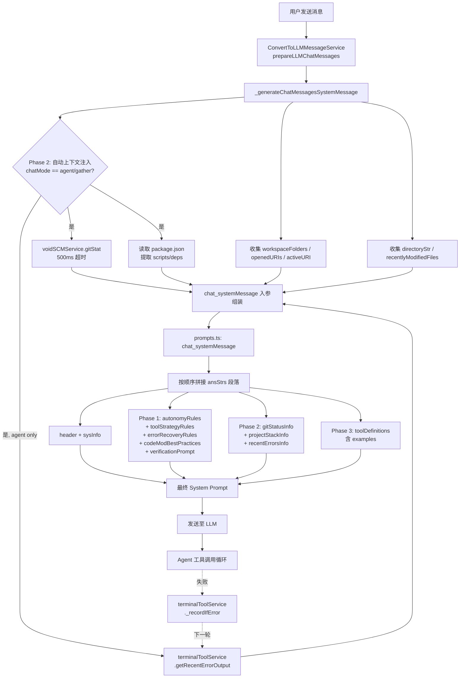
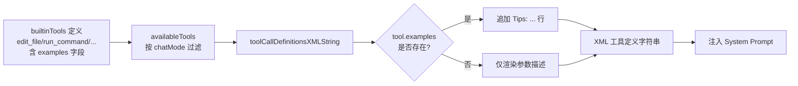
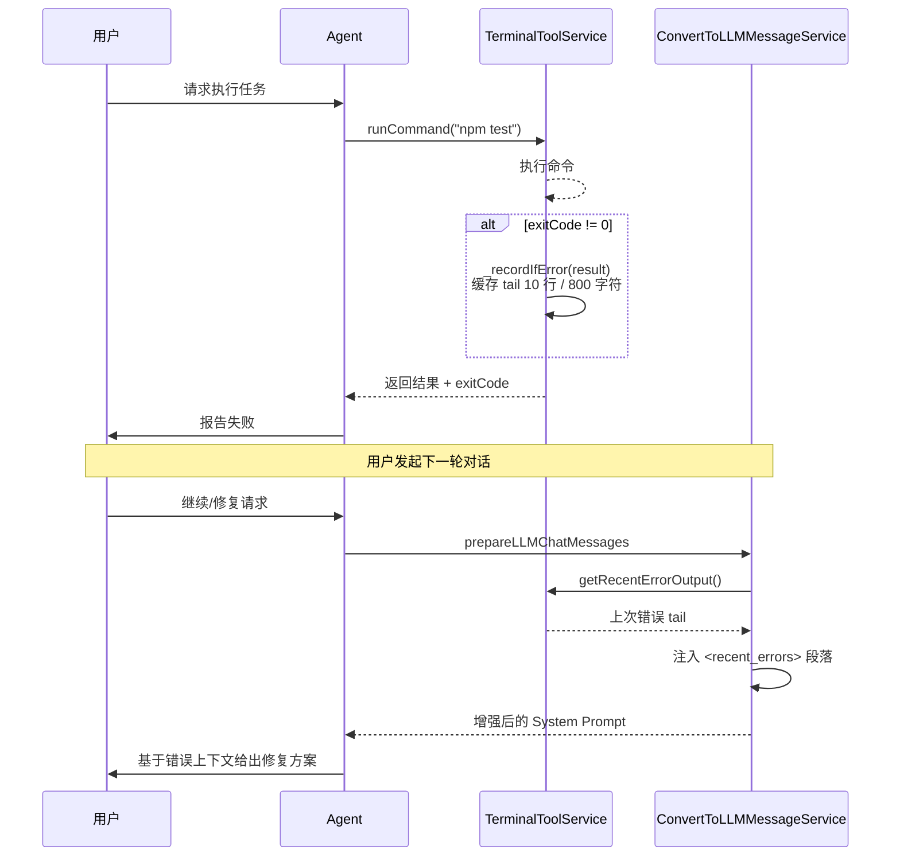

# 设计文档：增强 Agent 提示词与上下文工程

## 1. System Prompt 分段重构

### 当前问题
当前 `chat_systemMessage()` 使用扁平 `details.push()` 列表，所有规则平铺在一个编号列表中。
Claude Code 等成熟 Agent 使用**命名段落**结构，每段有明确主题和优先级。

### 设计方案

在 `prompts.ts` 的 `chat_systemMessage` 中，将 Agent 模式专属规则拆分为以下命名段落：

```
## Identity & Goal
## Tool Usage Strategy
## Code Modification Best Practices
## Error Recovery & Verification
## Output Format
```

每段只在 `mode === 'agent'` 时注入。

#### `## Tool Usage Strategy`（新增）
```
- Before modifying code, ALWAYS read the target file first to understand current state.
- For multi-file changes, read ALL affected files before making any edits.
- When a tool call fails, analyze the error and retry with corrected parameters. Do not repeat the same failed call.
- After making code changes, verify by running the project's build/lint command if available.
- Use search tools to find all usages of a symbol before renaming or modifying its signature.
```

#### `## Error Recovery`（新增）
```
- If a file edit fails (e.g., old_string not found), re-read the file to get current content, then retry.
- If a command fails, read the error output carefully. Common fixes:
  - Permission denied → suggest user intervention
  - Module not found → check imports and installed packages
  - Syntax error → re-read the file and fix the specific line
- After 2 consecutive failures on the same operation, step back and try a different approach.
```

#### `## Code Modification Best Practices`（新增）
```
- Read enough context (±50 lines) around the target before editing.
- Make edits that are self-contained: include all necessary imports, type annotations, and error handling.
- Prefer edit_file (surgical) over rewrite_file (full replacement) for existing files.
- When creating new files, always include appropriate imports and module structure.
- After completing edits, briefly verify by reading key sections of the modified file.
```

## 2. 自动上下文注入

### 在 `_generateChatMessagesSystemMessage` 中新增上下文收集：

#### 2.1 Git Status 摘要
```typescript
// 新增方法：_getGitStatusSummary()
// 通过 terminalToolService 或 child_process 执行 git status --short
// 截断到最多 30 行
// 输出格式：
// <git_status>
// M  src/file1.ts
// ??  src/file2.ts
// </git_status>
```

**注意**：此信息从 renderer 进程无法直接获取（无 child_process），需要：
- 方案 A：通过已有的 `run_command` 工具基础设施获取（但这会占用工具调用）
- **方案 B（选用）**：在 `convertToLLMMessageService` 中通过 `IFileService` 读取 `.git/status` 或通过 `SCMService` 获取 git 状态
- 方案 C：通过 Extension Host 的 git 扩展 API

实际实现：利用 VS Code 内置的 `ISCMService`（Source Control Manager）获取变更文件列表。

#### 2.2 项目技术栈摘要
```typescript
// 读取 workspace 根目录的 package.json
// 提取 name, scripts (前5个), dependencies (前10个), devDependencies (前5个)
// 输出格式：
// <project_stack>
// Project: my-app
// Scripts: dev, build, test, lint, start
// Dependencies: react, typescript, express, ...
// </project_stack>
```

#### 2.3 最近错误摘要
```typescript
// 从 terminalToolService 获取最近一次命令的 stderr 输出（如果有）
// 截断到最多 10 行
// 输出格式：
// <recent_errors>
// Error: Cannot find module './missing'
// at Object.<anonymous> (src/index.ts:3:1)
// </recent_errors>
```

## 3. 工具 Schema 增强

### 在工具定义中添加 `examples` 字段

```typescript
// toolDefs 中增加：
interface InternalToolInfo {
  // ... existing fields
  examples?: string[]  // 新增：使用示例
  commonErrors?: string[]  // 新增：常见错误提示
}
```

### 关键工具示例

**edit_file**:
```
Example: To replace "const x = 1" with "const x = 2" in /workspace/src/index.ts:
<edit_file>
<uri>/workspace/src/index.ts</uri>
<old_str>const x = 1</old_str>
<new_str>const x = 2</new_str>
</edit_file>
Common error: If old_str is not found, re-read the file to get the exact current content.
```

**run_command**:
```
Example: To run tests in the workspace:
<run_command>
<command>npm test</command>
<cwd>/workspace</cwd>
</run_command>
```

### XML 输出格式调整

在 `toolCallDefinitionsXMLString` 中，如果工具有 `examples`，追加：
```
    Example usage:
    <example>...</example>
```

## 4. 轻量验证提示

### 设计
在 `chatThreadService` 的工具执行循环中，当完成一次文件编辑工具后，检测是否存在 `package.json` 中的 build/lint script。如果存在，在工具结果消息后追加一条提示：

```
[Suggestion: You modified code. Consider running `npm run build` or `npm run lint` to verify correctness.]
```

这不强制执行，只是作为工具结果的附加提示，让 LLM 自行决定是否验证。

## 5. 数据流

```
用户消息 → prepareLLMChatMessages()
         → _generateChatMessagesSystemMessage()
            ├─ [现有] header, sysInfo, autonomyRules, ...
            ├─ [新增] toolStrategyRules     ← Phase 1
            ├─ [新增] gitStatusContext      ← Phase 2
            ├─ [新增] projectStackContext   ← Phase 2
            ├─ [新增] recentErrorsContext   ← Phase 2
            └─ [增强] toolDefinitions       ← Phase 3 (含 examples)
         → LLM 调用
         → 工具执行
            └─ [新增] 验证提示             ← Phase 4
```

### 5.1 System Prompt 组装流程图



### 5.2 工具示例渲染流程



### 5.3 错误上下文反馈闭环




## 6. 风险与回滚

- **Token 膨胀风险**：新增上下文可能超出 context window
  - 缓解：所有新增内容设置字符上限（git status 30行、stack 10行、errors 10行）
  - 总新增预估：~500-800 tokens，在 128k context 下可接受
- **性能风险**：git status 和文件读取可能慢
  - 缓解：设置 100ms 超时，超时则跳过
- **回滚**：所有新增内容都在 null check 后注入，设为 `null` 即可禁用
