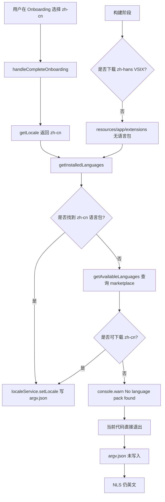
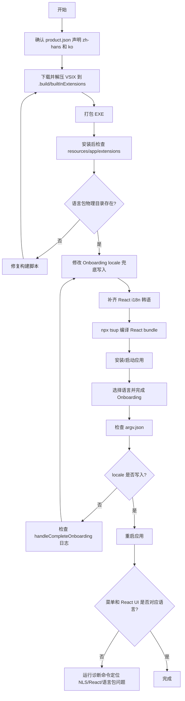
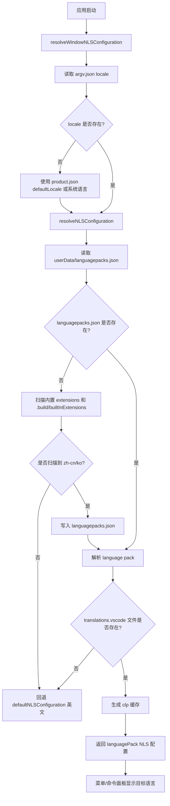

# Void 三语支持执行方案（EN / 简体中文 / 韩语）

> 目标：让 Void/YWCode 在 EXE 安装后支持 **英文 / 简体中文 / 韩语** 切换。
> 本文面向后续模型或开发者执行：只保留目标、根因、修改范围、执行步骤、验证方式和流程图。

---

## 1. 最终目标

### 1.1 用户效果

| 场景 | 预期效果 |
|------|----------|
| 首次安装并打开 | Onboarding 默认中文或可选择 EN / 中文 / 한국어 |
| 选择中文 | Void React UI 立即中文；重启后菜单/命令面板中文 |
| 选择韩语 | Void React UI 立即韩语；重启后菜单/命令面板韩语 |
| 选择英文 | 清除或设置英文 locale，UI 与菜单恢复英文 |

### 1.2 覆盖范围

| 层 | 覆盖内容 | 技术机制 |
|----|----------|----------|
| VSCode NLS 层 | 菜单、命令面板、原生设置标题 | 语言包扩展 + `argv.json` |
| Void React UI 层 | Onboarding、Chat、Settings、Void 自定义界面 | `src/.../react/src/i18n/` 内的 `t()` |

---

## 2. 当前状态结论

### 2.1 已经完成

| 项 | 状态 |
|----|------|
| React i18n 基础设施 | 已存在 |
| 英文语言文件 | 已存在 |
| 简体中文语言文件 | 已存在，约 430 个 key |
| Onboarding 接入 `t()` | 已接入 |
| React bundle 是否包含中文 | 已确认包含 |
| `product.json` 是否声明中文语言包 | 已声明 zh-hans |

### 2.2 尚未完成

| 问题 | 影响 |
|------|------|
| zh-hans 语言包 VSIX 未下载/未解压进构建产物 | 菜单/命令面板无法中文 |
| Onboarding 找不到语言包时没有兜底写入 `argv.json` | 用户选择中文后 NLS 不生效 |
| 韩语未进入 React i18n 类型和语言列表 | React UI 无韩语 |
| `product.json` 未声明韩语语言包 | NLS 无韩语 |
| `locales/ko.ts` 不存在 | React UI 无韩语翻译 |

---

## 3. 中文未生效的根因

### 3.1 不是 React bundle 问题

已检查：

- `src/vs/workbench/contrib/void/browser/react/out/void-onboarding/index.js`
- bundle 中已包含 `zh-cn` 翻译。
- `getInitialLocale()` 默认返回 `zh-cn`。

所以：**Onboarding/Chat/Settings 的中文 React UI 本身已经具备生效条件**。

### 3.2 真正断点



必须同时修复：

| 断点 | 原因 | 结果 |
|------|------|------|
| 断点 A | 构建产物缺少 zh-hans 语言包文件 | NLS 扫描不到中文包 |
| 断点 B | `handleCompleteOnboarding` 找不到包时不写 `argv.json` | 用户 locale 未持久化 |

---

## 4. 需要修改的文件和范围

### 4.1 P0：确保语言包物理打包

#### 文件 1：`product.json`

**修改范围：** `builtInExtensions` 区域。

**要做：**

- 保留现有 `ms-ceintl.vscode-language-pack-zh-hans`。
- 追加 `ms-ceintl.vscode-language-pack-ko`。

**验收：**

```powershell
Select-String -Path "product.json" -Pattern "vscode-language-pack-zh-hans","vscode-language-pack-ko"
```

---

#### 文件 2：构建脚本

可选方式：

1. 修改现有内置扩展下载流程。
2. 或新增脚本：`build/scripts/download-lang-packs.ps1`。
3. 或在打包前显式执行等价下载/解压步骤。

**目标目录：**

```text
.build/builtInExtensions/ms-ceintl.vscode-language-pack-zh-hans/
.build/builtInExtensions/ms-ceintl.vscode-language-pack-ko/
```

**安装包最终目录：**

```text
resources/app/extensions/ms-ceintl.vscode-language-pack-zh-hans/
resources/app/extensions/ms-ceintl.vscode-language-pack-ko/
```

**验收：**

```powershell
dir "i:\自动化执行\void-main\.build\builtInExtensions\*language-pack*"
dir "C:\Program Files\YWCode\resources\app\extensions\*language-pack*"
```

---

### 4.2 P0：修复 Onboarding 写入 locale 的兜底逻辑

#### 文件 3：`src/vs/workbench/contrib/void/browser/react/src/void-onboarding/VoidOnboarding.tsx`

**修改范围：**

- `writeLocalePreferenceForDev`：约第 666-687 行。
- `handleCompleteOnboarding`：约第 693-747 行。

**当前问题：**

找不到语言包时只执行：

```typescript
console.warn('No language pack found for locale:', reactLocale);
```

随后退出，不写 `argv.json`。

**要做：**

- 将 `writeLocalePreferenceForDev` 改成通用 `writeLocalePreference`。
- dev 和 production 都允许写 `environmentService.argvResource`。
- 当 `installedLanguages` 和 `availableLanguages` 都找不到目标 locale 时，仍兜底写入：

```typescript
await writeLocalePreference(reactLocale);
```

**验收：**

完成 Onboarding 后：

```powershell
cat "$env:APPDATA\YWCode\argv.json"
```

预期：

```json
{
  "locale": "zh-cn"
}
```

---

### 4.3 P1：补齐韩语 React UI

#### 文件 4：`src/vs/workbench/contrib/void/browser/react/src/i18n/types.ts`

**修改范围：**

```typescript
export type SupportedLocale = 'en' | 'zh-cn';
```

改为：

```typescript
export type SupportedLocale = 'en' | 'zh-cn' | 'ko';
```

---

#### 文件 5：`src/vs/workbench/contrib/void/browser/react/src/i18n/index.ts`

**修改范围：**

- import 区域。
- `translations` 对象。
- `getSupportedLocales()`。

**要做：**

```typescript
import { ko } from './locales/ko.js';

const translations = {
  en,
  'zh-cn': zhCN,
  ko,
};

return [
  { id: 'zh-cn', label: '简体中文', shortLabel: '中文' },
  { id: 'en', label: 'English', shortLabel: 'EN' },
  { id: 'ko', label: '한국어', shortLabel: '한국어' },
];
```

---

#### 文件 6：`src/vs/workbench/contrib/void/browser/react/src/i18n/locales/ko.ts`

**新建。**

**要求：**

- 结构与 `zh-cn.ts` 完全一致。
- key 必须覆盖 `TranslationKeys` 全部字段。
- 初版可先机器翻译，后续人工润色。

---

### 4.4 P1：重新编译 React bundle

修改 React 源码后，在目录：

```text
src/vs/workbench/contrib/void/browser/react/
```

执行：

```powershell
npx tsup
```

**需要确认更新的产物：**

```text
out/void-onboarding/index.js
out/void-settings-tsx/index.js
out/sidebar-tsx/index.js
```

---

## 5. 实施流程图



---

## 6. 运行时 NLS 加载流程图



---

## 7. 快速验证命令

### 7.1 检查 React UI 当前语言

在 DevTools Console：

```javascript
localStorage.getItem('void-locale')
```

预期：

```text
zh-cn / en / ko
```

---

### 7.2 检查 `argv.json`

```powershell
cat "$env:APPDATA\YWCode\argv.json"
```

预期中文：

```json
{ "locale": "zh-cn" }
```

预期韩语：

```json
{ "locale": "ko" }
```

---

### 7.3 检查 `languagepacks.json`

```powershell
cat "$env:APPDATA\YWCode\languagepacks.json"
```

预期至少包含：

```text
zh-cn
ko
```

---

### 7.4 检查语言包物理文件

开发环境：

```powershell
dir "i:\自动化执行\void-main\.build\builtInExtensions\*language-pack*"
```

安装环境：

```powershell
dir "C:\Program Files\YWCode\resources\app\extensions\*language-pack*"
```

预期：

```text
ms-ceintl.vscode-language-pack-zh-hans
ms-ceintl.vscode-language-pack-ko
```

---

## 8. 快速诊断脚本

当中文/韩语未生效时，运行：

```powershell
$root = "$env:APPDATA\YWCode"
$latestLog = Get-ChildItem "$root\logs" -ErrorAction SilentlyContinue |
  Sort-Object LastWriteTime -Descending |
  Select-Object -First 1

Write-Host "===== argv.json ====="
if (Test-Path "$root\argv.json") {
  Get-Content "$root\argv.json"
} else {
  Write-Host "argv.json not found"
}

Write-Host "`n===== languagepacks.json ====="
if (Test-Path "$root\languagepacks.json") {
  Get-Content "$root\languagepacks.json"
} else {
  Write-Host "languagepacks.json not found"
}

Write-Host "`n===== installed language packs ====="
Get-ChildItem "C:\Program Files\YWCode\resources\app\extensions" -ErrorAction SilentlyContinue |
  Where-Object { $_.Name -match "language-pack|zh|hans|ko" } |
  Select-Object Name, FullName

Write-Host "`n===== dev builtInExtensions ====="
Get-ChildItem "i:\自动化执行\void-main\.build\builtInExtensions" -ErrorAction SilentlyContinue |
  Where-Object { $_.Name -match "language-pack|zh|hans|ko" } |
  Select-Object Name, FullName

Write-Host "`n===== latest logs ====="
if ($latestLog) {
  Write-Host $latestLog.FullName
  Get-ChildItem $latestLog.FullName -Recurse -File |
    Select-String -Pattern "nls","locale","language","language pack","No language pack","Failed to set VSCode locale" |
    Select-Object Path, LineNumber, Line
} else {
  Write-Host "logs directory not found"
}
```

把输出贴回即可判断根因。

---

## 9. 诊断结果判定表

| 现象 | 根因 | 修复位置 |
|------|------|----------|
| `argv.json` 没有 `locale` | Onboarding 未写入 | `VoidOnboarding.tsx` |
| `argv.json` 有 `zh-cn`，菜单仍英文 | 语言包物理文件缺失或 NLS 扫描失败 | 构建脚本 / `nls.ts` 验证 |
| `languagepacks.json` 不存在 | 内置语言包未扫描到 | `.build/builtInExtensions` / `resources/app/extensions` |
| `languagepacks.json` 有 `zh-cn`，但翻译失败 | 缓存或翻译文件损坏 | 删除 `%APPDATA%\YWCode\clp` 后重启 |
| React UI 仍英文 | `localStorage['void-locale'] = 'en'` 或 bundle 未更新 | DevTools / `npx tsup` |
| 没有韩语选项 | `SupportedLocale` / `getSupportedLocales()` / `ko.ts` 未补齐 | React i18n 文件 |

---

## 10. 建议添加的临时日志

### 10.1 `VoidOnboarding.tsx`

位置：`handleCompleteOnboarding`。

```typescript
console.log('[i18n:onboarding] start', { reactLocale, isDevMode });
console.log('[i18n:onboarding] installedLanguages', installedLanguages);
console.log('[i18n:onboarding] availableLanguages', availableLanguages);
console.log('[i18n:onboarding] fallback write argv locale', reactLocale);
console.error('[i18n:onboarding] failed', e);
```

### 10.2 `src/vs/base/node/nls.ts`

位置：

- `resolveNLSConfiguration`
- `getBuiltInExtensionsPaths`
- `getBuiltInLanguagePackConfigurations`

```typescript
console.log('[i18n:nls] resolve start', { userLocale, osLocale, userDataPath, nlsMetadataPath });
console.log('[i18n:nls] builtin extension paths', getBuiltInExtensionsPaths(nlsMetadataPath));
console.log('[i18n:nls] builtin language packs', Object.keys(languagePacks));
console.log('[i18n:nls] resolvedLanguage', resolvedLanguage);
console.log('[i18n:nls] mainLanguagePackPath', mainLanguagePackPath);
```

> 临时日志用于定位，发布前可删除，或改成环境变量控制。

---

## 11. 最小中文修复路径

如果只先修中文，不做韩语：

1. 确保 `ms-ceintl.vscode-language-pack-zh-hans` 被下载并打进：
   - `.build/builtInExtensions/`
   - 最终 `resources/app/extensions/`
2. 修改 `VoidOnboarding.tsx`：
   - 找不到语言包时仍写 `argv.json locale=zh-cn`。
3. 重新编译 React bundle：
   - `npx tsup`
4. 重新打包 EXE。
5. 新装验证：
   - Onboarding 中文。
   - `%APPDATA%\YWCode\argv.json` 有 `"locale": "zh-cn"`。
   - 重启后菜单/命令面板中文。

---

## 12. 完整三语验收清单

- [ ] `product.json` 包含 zh-hans 和 ko。
- [ ] `.build/builtInExtensions/ms-ceintl.vscode-language-pack-zh-hans/package.json` 存在。
- [ ] `.build/builtInExtensions/ms-ceintl.vscode-language-pack-ko/package.json` 存在。
- [ ] 安装后 `resources/app/extensions/` 包含两个语言包。
- [ ] `SupportedLocale` 包含 `'en' | 'zh-cn' | 'ko'`。
- [ ] `locales/ko.ts` 存在且 key 完整。
- [ ] `getSupportedLocales()` 显示 EN / 简体中文 / 한국어。
- [ ] Onboarding 切中文后 React UI 立即中文。
- [ ] Onboarding 切韩语后 React UI 立即韩语。
- [ ] 完成 Onboarding 后 `argv.json` 正确写入 locale。
- [ ] 重启后菜单/命令面板显示对应语言。
- [ ] 运行诊断脚本无关键错误。
